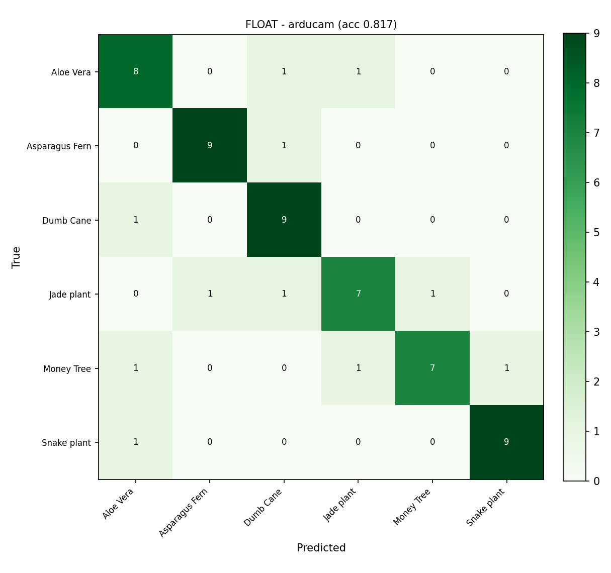
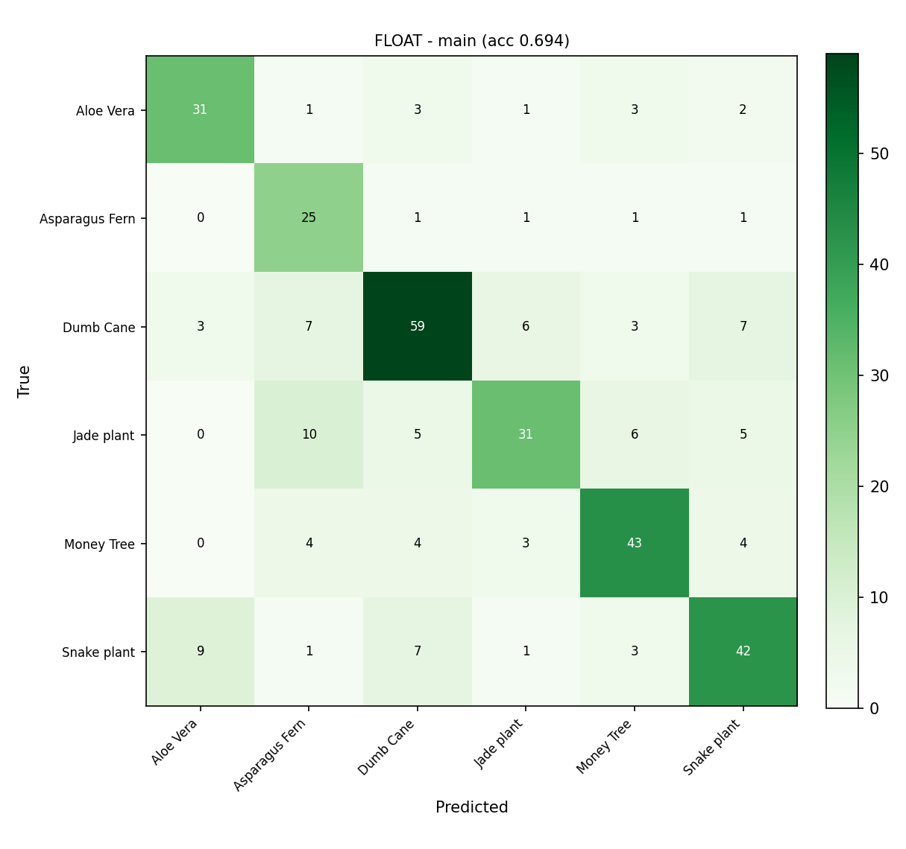
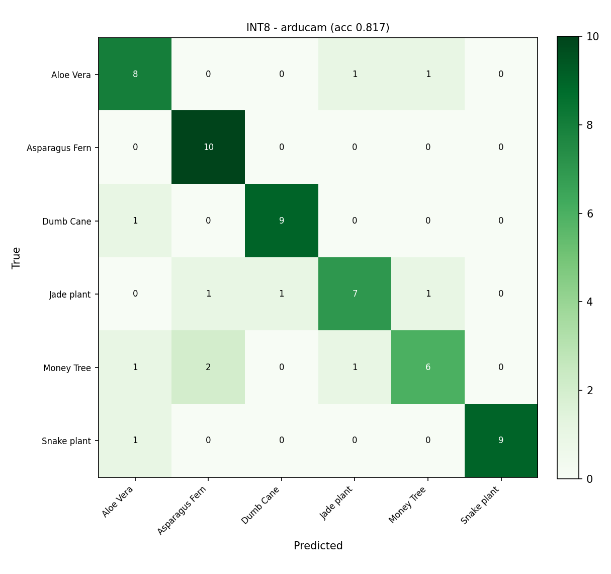
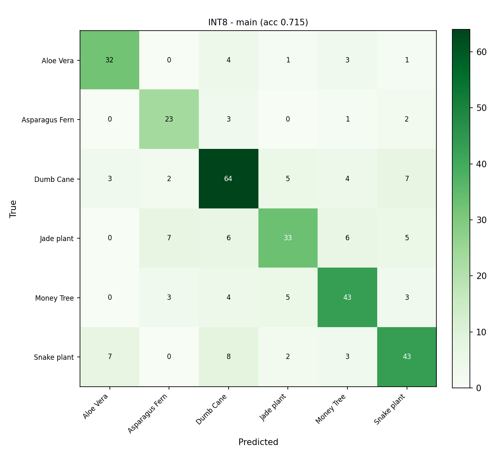

# Houseplant Classifier - Results

Generated by `report_metrics.py`. Models and test sets are the already-trained artifacts; this script only evaluates and reports.

- **FLOAT** = `models/plant_model.keras` (big float model)
- **INT8** = `models/plant_model_int8.tflite` (deployed, post-training quantization)
- **arducam test** = held-out OV7675 frames; **main test** = held-out Kaggle + phone images.

> Note: the arducam test frames are correlated with the arducam training frames (captured in the same sessions), so arducam test accuracy is optimistic; the live on-device demo is the true measure.

## Summary

| Model | Test set | Accuracy | Macro-F1 | Weighted-F1 | Size |
|---|---|---|---|---|---|
| FLOAT | arducam | 0.8167 | 0.816 | 0.816 | 849 KB |
| FLOAT | main | 0.6937 | 0.690 | 0.693 | 849 KB |
| INT8 | arducam | 0.8167 | 0.814 | 0.814 | 303 KB |
| INT8 | main | 0.7147 | 0.715 | 0.713 | 303 KB |

Size is the on-disk `.tflite` file size. The deployment-resource table below adds latency and on-device memory.

## Deployment resources

Target hardware: **Arduino Nano 33 BLE Sense (nRF52840)**. The INT8 model is the one flashed to the device; the float model is shown for comparison only.

| Model | Flash (model) | Tensor arena (used / reserved) | Latency (host)* | Output |
|---|---|---|---|---|
| INT8 (deployed) | 303 KB | 100.4 KB / 112 KB | 0.15 ms | Serial dashboard |
| Float (reference) | 849 KB | n/a (not deployed) | 0.28 ms | - |

*Latency is a HOST estimate (mean single-frame `Invoke` over the arducam test set) for relative comparison; true on-device latency differs. Tensor-arena 'used' is `arena_used_bytes()` measured on the Arduino Nano 33 BLE Sense (nRF52840) at boot; 'reserved' is `kTensorArenaSize` in `plant_infer.ino`. The arena is the dominant RAM cost on the 256 KB device.

### FLOAT model - arducam test set

Overall accuracy: **0.8167**  |  macro-F1: **0.816**  |  weighted-F1: **0.816**

**Per-class metrics**

| Class | Precision | Recall | F1 | Support |
|---|---|---|---|---|
| Aloe Vera | 0.727 | 0.800 | 0.762 | 10 |
| Asparagus Fern | 0.900 | 0.900 | 0.900 | 10 |
| Dumb Cane | 0.750 | 0.900 | 0.818 | 10 |
| Jade plant | 0.778 | 0.700 | 0.737 | 10 |
| Money Tree | 0.875 | 0.700 | 0.778 | 10 |
| Snake plant | 0.900 | 0.900 | 0.900 | 10 |
| **macro avg** | 0.822 | 0.817 | 0.816 | 60 |
| **weighted avg** | 0.822 | 0.817 | 0.816 | 60 |

**Confusion matrix** (rows = true, cols = predicted)

| true \ pred | Aloe Vera | Asparagus Fern | Dumb Cane | Jade plant | Money Tree | Snake plant |
|---|---|---|---|---|---|---|
| **Aloe Vera** | 8 | 0 | 1 | 1 | 0 | 0 |
| **Asparagus Fern** | 0 | 9 | 1 | 0 | 0 | 0 |
| **Dumb Cane** | 1 | 0 | 9 | 0 | 0 | 0 |
| **Jade plant** | 0 | 1 | 1 | 7 | 1 | 0 |
| **Money Tree** | 1 | 0 | 0 | 1 | 7 | 1 |
| **Snake plant** | 1 | 0 | 0 | 0 | 0 | 9 |

### FLOAT model - main test set

Overall accuracy: **0.6937**  |  macro-F1: **0.690**  |  weighted-F1: **0.693**

**Per-class metrics**

| Class | Precision | Recall | F1 | Support |
|---|---|---|---|---|
| Aloe Vera | 0.721 | 0.756 | 0.738 | 41 |
| Asparagus Fern | 0.521 | 0.862 | 0.649 | 29 |
| Dumb Cane | 0.747 | 0.694 | 0.720 | 85 |
| Jade plant | 0.721 | 0.544 | 0.620 | 57 |
| Money Tree | 0.729 | 0.741 | 0.735 | 58 |
| Snake plant | 0.689 | 0.667 | 0.677 | 63 |
| **macro avg** | 0.688 | 0.711 | 0.690 | 333 |
| **weighted avg** | 0.705 | 0.694 | 0.693 | 333 |

**Confusion matrix** (rows = true, cols = predicted)

| true \ pred | Aloe Vera | Asparagus Fern | Dumb Cane | Jade plant | Money Tree | Snake plant |
|---|---|---|---|---|---|---|
| **Aloe Vera** | 31 | 1 | 3 | 1 | 3 | 2 |
| **Asparagus Fern** | 0 | 25 | 1 | 1 | 1 | 1 |
| **Dumb Cane** | 3 | 7 | 59 | 6 | 3 | 7 |
| **Jade plant** | 0 | 10 | 5 | 31 | 6 | 5 |
| **Money Tree** | 0 | 4 | 4 | 3 | 43 | 4 |
| **Snake plant** | 9 | 1 | 7 | 1 | 3 | 42 |

### INT8 model - arducam test set

Overall accuracy: **0.8167**  |  macro-F1: **0.814**  |  weighted-F1: **0.814**

**Per-class metrics**

| Class | Precision | Recall | F1 | Support |
|---|---|---|---|---|
| Aloe Vera | 0.727 | 0.800 | 0.762 | 10 |
| Asparagus Fern | 0.769 | 1.000 | 0.870 | 10 |
| Dumb Cane | 0.900 | 0.900 | 0.900 | 10 |
| Jade plant | 0.778 | 0.700 | 0.737 | 10 |
| Money Tree | 0.750 | 0.600 | 0.667 | 10 |
| Snake plant | 1.000 | 0.900 | 0.947 | 10 |
| **macro avg** | 0.821 | 0.817 | 0.814 | 60 |
| **weighted avg** | 0.821 | 0.817 | 0.814 | 60 |

**Confusion matrix** (rows = true, cols = predicted)

| true \ pred | Aloe Vera | Asparagus Fern | Dumb Cane | Jade plant | Money Tree | Snake plant |
|---|---|---|---|---|---|---|
| **Aloe Vera** | 8 | 0 | 0 | 1 | 1 | 0 |
| **Asparagus Fern** | 0 | 10 | 0 | 0 | 0 | 0 |
| **Dumb Cane** | 1 | 0 | 9 | 0 | 0 | 0 |
| **Jade plant** | 0 | 1 | 1 | 7 | 1 | 0 |
| **Money Tree** | 1 | 2 | 0 | 1 | 6 | 0 |
| **Snake plant** | 1 | 0 | 0 | 0 | 0 | 9 |

### INT8 model - main test set

Overall accuracy: **0.7147**  |  macro-F1: **0.715**  |  weighted-F1: **0.713**

**Per-class metrics**

| Class | Precision | Recall | F1 | Support |
|---|---|---|---|---|
| Aloe Vera | 0.762 | 0.780 | 0.771 | 41 |
| Asparagus Fern | 0.657 | 0.793 | 0.719 | 29 |
| Dumb Cane | 0.719 | 0.753 | 0.736 | 85 |
| Jade plant | 0.717 | 0.579 | 0.641 | 57 |
| Money Tree | 0.717 | 0.741 | 0.729 | 58 |
| Snake plant | 0.705 | 0.683 | 0.694 | 63 |
| **macro avg** | 0.713 | 0.722 | 0.715 | 333 |
| **weighted avg** | 0.716 | 0.715 | 0.713 | 333 |

**Confusion matrix** (rows = true, cols = predicted)

| true \ pred | Aloe Vera | Asparagus Fern | Dumb Cane | Jade plant | Money Tree | Snake plant |
|---|---|---|---|---|---|---|
| **Aloe Vera** | 32 | 0 | 4 | 1 | 3 | 1 |
| **Asparagus Fern** | 0 | 23 | 3 | 0 | 1 | 2 |
| **Dumb Cane** | 3 | 2 | 64 | 5 | 4 | 7 |
| **Jade plant** | 0 | 7 | 6 | 33 | 6 | 5 |
| **Money Tree** | 0 | 3 | 4 | 5 | 43 | 3 |
| **Snake plant** | 7 | 0 | 8 | 2 | 3 | 43 |
